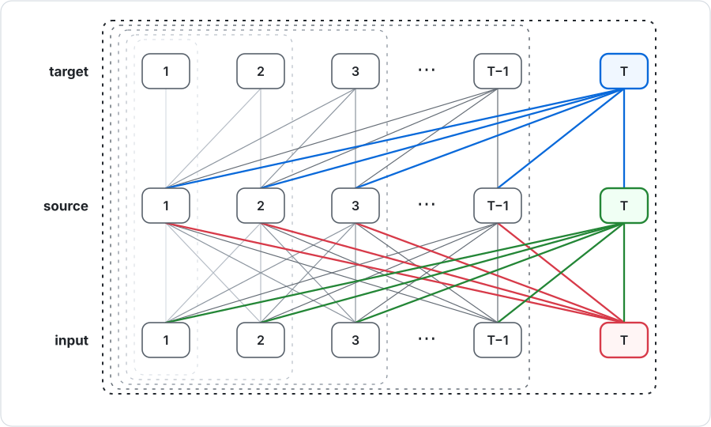

# Future-aware KV: full attention inside causal attention

We implemented an attention layer where old tokens update their keys and values
from newly arrived tokens before the current query reads them.
**Training/prefill takes O(T²d), decode takes O(td) per token, and the decode
cache takes O(td)**—the same asymptotic scaling as ordinary dense attention,
with additional work inside those bounds.

The obvious construction would rerun full attention for every visible prefix,
costing O(T³d) for prefill and O(t²d) for decode token `t`. The central
observation here is that we do not need to rerun it: one full-prefix update
stage can be folded into causal attention by carrying its online-softmax state.

This repository is about that algorithmic principle and the family of
attention layers it permits. It includes one concrete multihead PyTorch layer,
a readable matrix reference, and a reproducible many-to-one experiment.

## Why let old KV change?

In a causal Transformer, a token's key/value at a given layer is computed when
that token is processed. Later queries reuse it, but it cannot incorporate tokens
that arrived afterward. For example, a source representing an ambiguous name
cannot revise its representation when a later sentence explains who it means.

What if we update old KV before retrieving from it? At current position `t`,
source position `s <= t` could summarize the whole **visible prefix `0..t`**,
including positions after `s`. Its KV is future-aware relative to `s`. Output
`t` still sees nothing after `t`, so next-token prediction remains causal.
Earlier outputs are not revised; only the memories used for subsequent outputs
change.

[GoldFinch](https://arxiv.org/abs/2407.12077) uses RWKV/Finch recurrence to
construct a reusable cache in linear time, then Transformer attention to read
from it during generation. This suggested separating KV construction from the
component that reads KV to predict the next token.

Our earlier experiment reversed the recurrent scan. At each decode position,
we scanned the visible prefix from right to left, constructing memories that
contained later-token information and immediately retrieving from them:

```python
def decode_reversed_rnn(t):
    # Rebuild right-to-left memories over the visible prefix for this output.
    state = initial_rnn_state()
    retrieval = initial_attention_state()
    for s in range(t, -1, -1):
        state = rnn_update(state, input_at_position=s)
        retrieval = attention_update(retrieval, memory=state, query_at_position=t)
    return retrieval.output
```

A linear scan plus retrieval costs O(td), matching dense attention decode's
sequence-length scaling. Reversal experiments motivated pursuing this direction,
but long recurrent paths were a concern for information retention. Kernel work
also exposed expensive recomputation and numerical instability when recovering
previous recurrent states during backward.

F+C means **full-prefix attention (F) followed by causal attention (C)**.
It replaced the reversed RNN with attention: each source has a query and an
attention summary that grows with the visible prefix. C then retrieves from
those changing source memories. The essential idea is this update-and-retrieve
schedule, rather than one particular choice of projections.

Many parameterizations fit the same schedule. F may produce one shared memory
or separate contextual keys and values. Those paths may share or separate their
attention geometry, and the contextual memory may be combined with an unchanged
source projection. The code in this repository makes one such set of choices so
that the principle can be run and tested end to end.

## The core schedule

There are two attentions:

- **F: full-prefix attention.** Source `s` reads every input `j` in the currently
  visible prefix, regardless of whether `j` is before or after `s`.
- **C: causal attention.** Current target `t` retrieves from updated sources
  `s <= t`.

An online attention update adds one input to a softmax-weighted summary without
recomputing its previous inputs. The following conceptual training/prefill
schedule makes the dependency explicit; the concrete functions are defined below.

```python
# T = number of input tokens; t = current output; s = memory/source position.
# Each F[s] holds the full-attention state needed by source s.
F = [empty_state(kind="full") for s in range(T)]
for t in range(T):
    C = empty_state(kind="causal")     # Retrieval accumulator for output t.
    for s in range(T):                 # Source updates can run in parallel.
        update_full(F, input=t, source=s)
        if s <= t:                     # Never retrieve from a future source.
            C = update_causal(C, F, source=s, target=t)
    Y[t] = C.output                    # Normalized by the online update.
```

During training/prefill all source queries are available. Even a source `s > t`
can accumulate private F state ahead of its first retrieval, because the C mask
prevents that state from affecting an earlier output. Each `(s,t)` pair receives
one F update; C reads each causally valid pair once. Work is O(T²d), rather than
recomputing a full-prefix contextualizer from scratch for every output.

This is different from two ordinary stacked causal layers: in those layers,
source `s`'s first-layer output uses only inputs `0..s`. Here its contextual
memory at target `t` uses inputs `0..t`, and continues changing as `t` grows.

### Why one decode step is O(T)

When input `T` arrives, the earlier source states already summarize inputs
`1..T-1`. Decoding needs only three new linear groups of work: update the
`T-1` existing sources with input `T`, initialize the new source `T` from the
whole visible prefix, and retrieve all `T` sources into target `T`.



That is `(T-1) + T + T = 3T-1 = O(T)` attention updates. A family member with
separate F paths for keys and values adds a constant factor, without changing
the asymptotic cost. Prefill performs the same decode step for every prefix, so
its total work is `sum(t=1..T) O(t) = O(T²)`.

## One concrete FA-KV implementation

The implementation included here uses separate F attention geometry for the
contextual key and value, and separate projections for the unchanged source
bypass and the payload transported through F. These are implementation choices,
not requirements of the FA-KV family. This release keeps one concrete candidate:
F uses RoPE plus a learned soft past/future window, while C uses ALiBi. During
inference the learned distances are floored to integers and F uses an exact
hard window.

Project nine vectors per token **per head**:

```python
QFK = X @ W_QFK  # F queries for contextual keys.
KFK = X @ W_KFK  # F keys for contextual keys.
QFV = X @ W_QFV  # Independent F queries for contextual values.
KFV = X @ W_KFV  # Independent F keys for contextual values.
QC  = X @ W_QC   # C queries: what does the current target retrieve?
KC0 = X @ W_KC0  # Original-source key bypass.
KCF = X @ W_KCF  # Key payload transported through F.
VC0 = X @ W_VC0  # Original-source value bypass.
VCF = X @ W_VCF  # Value payload transported through F.
```

The following pseudocode describes one head. `dot` is a vector dot product,
`zeros(d)` a zero vector, and `softmax` normalizes a list of scores. `d` is head
width. Batch and head loops are omitted; the same computation runs independently
for every batch item and head.

First, a naive O(T³d) implementation: recompute every source's full-prefix
summary separately for every target. This directly expresses this particular
member, but it is not the fast schedule described above.

`window_log_weight(s, j)` is a learned log-sigmoid penalty based on the distance
from source `s` to input `j`. It is smooth during training. In hard inference it
is zero inside the learned past/future boundaries and `-infinity` outside them.
`rope_dot` applies RoPE using positions `s` and `j`; `alibi(t, s)` is the scalar
relative-position bias used by C.

```python
for t in range(T):                            # Output/query position.
    keys, values = [], []
    for s in range(t + 1):                    # Sources C is allowed to read.
        # The key and value memories can learn different F geometries.
        scores_fk = [rope_dot(QFK[s], KFK[j], s, j) / sqrt(d)
                     + window_log_weight(s, j) for j in range(t + 1)]
        scores_fv = [rope_dot(QFV[s], KFV[j], s, j) / sqrt(d)
                     + window_log_weight(s, j) for j in range(t + 1)]
        weights_fk = softmax(scores_fk)       # F scores the visible prefix.
        weights_fv = softmax(scores_fv)
        context_k, context_v = zeros(d), zeros(d)
        for j in range(t + 1):
            context_k += weights_fk[j] * KCF[j]
            context_v += weights_fv[j] * VCF[j]
        keys.append(gK * KC0[s] + (1 - gK) * context_k)
        values.append(gV * VC0[s] + (1 - gV) * context_v)

    scores_c = [dot(QC[t], keys[s]) / sqrt(d) + alibi(t, s)
                for s in range(t + 1)]
    weights_c = softmax(scores_c)
    Y[t] = sum(weights_c[s] * values[s] for s in range(t + 1))
```

`KC0` and `VC0` are immutable bases. `KCF` and `VCF` are the payloads summarized
by F. The learned per-head gates `gK` and `gV` preserve an
**original-source bypass** alongside the visible-prefix summary. This was
inspired by GoldFinch's second-value addition and use of original token
embeddings, rather than copying either mechanism exactly.

**Heads are not mixed between F and C.** C head `h` reads only the contextual
KV produced by F head `h`, with no intervening output projection.
Run the single-head computation above independently for each head, then:

```python
# Y_by_head[h][t] = Y[t] from the single-head loops, run for head h.
# Only this final projection mixes heads; there is no output projection for F.
for t in range(T):
    output[t] = concat(*(Y_by_head[h][t] for h in range(heads))) @ W_OC
```

The included layer uses ten bias-free matrices: the nine projections above and
the final W_OC. This is one implementation choice, not part of the family
definition; projections may be shared or removed, gates may be fixed, and heads
may share parameters in many different ways. Finding the best parameterization
for a task is separate work.

### Online version: reuse each source's prefix summary

Here is a stable online-softmax update, used by both F and C. Each state has
named fields: a scalar maximum score, a scalar rescaled weight sum, and a
normalized output vector. The key and value paths have separate F states; C
holds one retrieved value vector.

```python
class AttentionState:
    def __init__(self, *, maximum=-infinity, denominator=0, output):
        self.maximum = maximum
        self.denominator = denominator
        self.output = output


def empty_state():
    return AttentionState(output=zeros(d))


def online_update(state, score, payload):
    M, L, Z = state.maximum, state.denominator, state.output
    next_M = max(M, score)
    old_weight = 0 if L == 0 else L * exp(M - next_M)
    new_weight = exp(score - next_M)
    next_L = old_weight + new_weight
    p = new_weight / next_L
    next_Z = Z + p * (payload - Z)  # Incorporate this input into the mean.
    return AttentionState(maximum=next_M, denominator=next_L, output=next_Z)


def update_full(F, qf, kf, payload, input, source):
    score = rope_dot(qf[source], kf[input], source, input) / sqrt(d)
    score += window_log_weight(source, input)
    F[source] = online_update(F[source], score, payload[input])


def update_causal(C, FK, FV, source, target):
    key = gK * KC0[source] + (1 - gK) * FK[source].output
    value = gV * VC0[source] + (1 - gV) * FV[source].output
    score = dot(QC[target], key) / sqrt(d) + alibi(target, source)
    return online_update(C, score, value)


# Training/prefill for ONE head: O(T²d) work and O(Td) running summary state.
FK = [empty_state() for s in range(T)]
FV = [empty_state() for s in range(T)]
for t in range(T):
    C = empty_state()
    for s in range(T):              # Independent F states across sources.
        update_full(FK, QFK, KFK, KCF, input=t, source=s)
        update_full(FV, QFV, KFV, VCF, input=t, source=s)
        if s <= t:
            C = update_causal(C, FK, FV, source=s, target=t)
    Y[t] = C.output

# Repeat per head, then concatenate Y_by_head[h][t] and apply W_OC as above.
```

### Decode: initialize the new source, then update existing sources

At decode position `t`, earlier projections and their F states are cached.
For one head, project the arriving input X[t], initialize its new source state,
then update every live source:

```python
QFK[t], KFK[t] = X[t] @ W_QFK, X[t] @ W_KFK
QFV[t], KFV[t] = X[t] @ W_QFV, X[t] @ W_KFV
QC[t] = X[t] @ W_QC
KC0[t], KCF[t] = X[t] @ W_KC0, X[t] @ W_KCF
VC0[t], VCF[t] = X[t] @ W_VC0, X[t] @ W_VCF

# 1. QFK[t] and QFV[t] are NEW queries: they have never read earlier inputs.
#    Build their summaries of inputs 0..t-1. Existing sources already have theirs.
FK.append(empty_state())
FV.append(empty_state())
for j in range(t):
    update_full(FK, QFK, KFK, KCF, input=j, source=t)
    update_full(FV, QFV, KFV, VCF, input=j, source=t)

# 2. Add the arriving input t to EVERY live source, including the new source.
#    After each update, that source summarizes exactly inputs 0..t.
C = empty_state()
for s in range(t + 1):
    update_full(FK, QFK, KFK, KCF, input=t, source=s)
    update_full(FV, QFV, KFV, VCF, input=t, source=s)
    C = update_causal(C, FK, FV, source=s, target=t)
Y[t] = C.output

# The new source's diagonal input t was added only in the second loop.
# Keep original projections and F summaries for the next decode step.
# Repeat for every head, then mix only the C outputs:
# output[t] = concat(*(Y_by_head[h][t] for h in range(heads))) @ W_OC
```

Both loops are linear in the prefix length. Updating old KV adds work but does
not change dense attention's O(td) per-token work or O(td) cache scaling.
Source F updates are independent; C retrieval is a parallelizable softmax
reduction.

## Cubic matrix reference

The online schedule above is the important algorithmic result: one full-prefix
attention can be folded into causal attention without changing dense
attention's asymptotic O(T²d) prefill, O(td) decode-per-token, or O(td) cache.
Naively rerunning full attention for every prefix would instead cost O(T³d)
prefill and O(t²d) for decode token `t`.

The compact implementation in this branch deliberately uses a different
all-output reference. It algebraically eliminates the contextual `[T,T,d]`
tensors, but performs generic `T x T @ T x T` products. It therefore costs
O(T³) arithmetic and O(T²) memory. At the short sequence lengths in the
many-to-one experiment, these large matrix multiplications are simpler and can
be faster than a Python-looped quadratic recurrence. They also provide ordinary
autograd and a readable correctness oracle.

[Future work](FUTURE_WORK.md) gives simple pseudocode for three implementations:
the cubic matrix reference, a materialized prefix tensor, and a block-prefix
construction that combines quadratic compute with quadratic memory.

## Install and use

Python 3.10+. Install the appropriate PyTorch build for your machine first.

```sh
python -m venv .venv
. .venv/bin/activate
python -m pip install --upgrade pip
python -m pip install -e '.[test]'
python -m pytest -q
```

```python
import torch
from future_aware_kv import FutureAwareKVAttention

# 768 model channels, 6 independent heads, 128 channels per head.
layer = FutureAwareKVAttention(
    width=768,
    heads=6,
    threshold_reference_length=128,
)
x = torch.randn(2, 128, 768)              # [batch, tokens, model width]
y = layer(x)                               # Same shape as x.
loss = y.square().mean()
loss.backward()
```

This is an attention mixer: add your model's residual connections, normalization
and MLP around it, as you would for ordinary attention. Heads remain independent
inside F and C; the final output projection mixes them.

The layer uses a soft window by default so its thresholds receive gradients.
Anneal `layer.threshold_temperature` during training; the included experiment
holds it at `4.0`, anneals it to `0.25`, then holds it there. Set
`layer.hard_window = True` for exact-window inference. RoPE is applied only to
the four F query/key projections; C uses ALiBi and transported payloads remain
in a shared coordinate frame.

The layer assumes every row is a complete sequence; padding is treated as real
input unless you avoid it. Attention dropout, arbitrary masks, and a decode
cache are not implemented in this compact release. This module has its own API
rather than `nn.MultiheadAttention`'s signature.

## Experiments

The [many-to-one experiment](results/many_to_one.md) uses two token classes,
written as lowercase and uppercase letters. The body contains `G` groups; each
group has `m` unique lowercase tokens followed by one uppercase label. After the
body, the model receives one lowercase token and must return its group's label:

```text
body:   a b c A   d e f B
query:  e
answer: B
```

The comparison uses the hybrid soft-window FA-KV candidate above with one MLP,
and a baseline with two ordinary causal-attention+MLP blocks. Each sequence
independently shifts its group boundaries. Both recipes receive the same
validation-only tuning budget and are then evaluated on three fresh seeds. At
`m=64`, hard-window FA-KV reaches **99.45%** mean test accuracy while 2A reaches
**84.17%**; neither solves `m=128`. The detailed report defines the protocol,
records the nonmonotonic `m=16` result, and includes every per-seed value.

The exact experiment is in `experiments/many_to_one.py`; `run_all.sh` reproduces
the complete frozen-recipe grid, and compact per-seed values are in
[results/many_to_one.csv](results/many_to_one.csv). These results show a useful
synthetic binding behavior, not a language-model quality advantage.

## Related work

[GoldFinch](https://arxiv.org/abs/2407.12077) motivated the separation of KV
construction from retrieval. This implementation is not a reproduction of it.

[RetroAttention](https://arxiv.org/abs/2508.09001) also revises past attention
outputs and overwrites KV during generation. It uses a bounded retrospective
window to recover missed sparse-attention information; our operator instead
updates every source over the growing prefix and is trained as that operator.
These connections do not establish novelty of the exact formulation.
